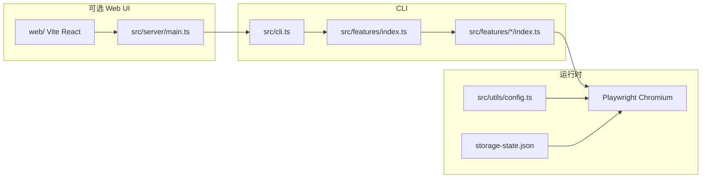

# doudian-master

抖店后台自动化运营：**Node.js + Playwright** 驱动浏览器完成登录态持久化与各页面功能脚本；可选 **Express + React（Vite）** 本地控制台触发 CLI。

## 架构概览

## 目录结构（摘要）

| 路径 | 角色 |
| --- | --- |
| `src/cli.ts` | CLI 入口：`--feature`、`--save-session` / `--save-session=watch` / `--save-session=edge`、`--list` |
| `src/features/` | 业务功能模块；在 `index.ts` 注册；各子目录 **`README.md`** 为白话流程说明（见 [**src/features/README.md**](src/features/README.md)） |
| `src/features/types.ts` | `FeatureModule`（`id`、`displayName`、`run`） |
| `src/utils/` | 浏览器启动、`storageState`、配置、日志等 |
| `src/server/main.ts` | 本地 HTTP API，复用 `listFeatures` / 子进程跑 CLI |
| `web/` | Vite + React 控制台前端 |
| `harness/` | Cursor / 收尾脚本、环境默认值（`harness.env`） |
| `.cursor/hooks.json` | Cursor Agent hooks（含保存 feature 后刷新本文档功能表） |

## CLI 与登录态

- **执行功能**：`npm run dev -- --feature=<id>`；列出：`npm run dev -- --list`。
- **持久登录**：`npm run dev -- --save-session`，在浏览器完成登录后于终端按 Enter，写入默认路径 `.data/storage-state.json`（可用环境变量 `STORAGE_STATE_PATH` 覆盖）。登录态文件放在 **`.data/`（或你配置的绝对/相对路径）**，勿写入 `src/features/` 以免误提交。
- **自动刷新登录态（Chromium）**：`PLAYWRIGHT_HEADED=1 npm run dev -- --save-session=watch` — 打开门户后监听页面导航，按与「工作台校验」一致的 URL/标题规则检测到已进入已登录抖店时，自动把当前上下文写入 `STORAGE_STATE_PATH`（边沿触发，避免重复写盘）。可选设置 `DOUDIAN_FXG_LOGIN_SIGNAL_URL`（支持 `*` 通配）与 `DOUDIAN_FXG_LOGIN_SIGNAL_BODY_SUBSTRING`，要求额外匹配到相关 XHR/fetch（body 子串会调用 `response.text()`，极少数接口可能与页面抢读响应体）。节流间隔见 `DOUDIAN_STORAGE_AUTOSAVE_MIN_INTERVAL_MS`。完成后在终端按 Enter 退出；若当前仍判定为已登录会再保存一次。
- **Edge profile 导出登录态（免扫码）**：`EDGE_USER_DATA_DIR=.data/edge-profile npm run dev -- --save-session=edge`（或 `npm run dev -- --save-session --via=edge`）。使用 Edge persistent profile 复用长期登录，自动打开工作台断言通过后写入 `STORAGE_STATE_PATH`。**不要**把 `EDGE_USER_DATA_DIR` 指到正在使用的系统 Edge profile；若启动失败，先关闭 Edge 或改用 `.data/edge-profile`。详见 [**docs/script/session.md**](docs/script/session.md)。
- **邮箱密码自动登录（可选）**：仅填写本地 `.env`（勿提交）。设置 `DOUDIAN_PASSWORD_LOGIN=1`、`DOUDIAN_LOGIN_EMAIL`、`DOUDIAN_LOGIN_PASSWORD`，并建议使用 **`PLAYWRIGHT_HEADED=1`**。执行 `npm run dev -- --feature=login`：门户 → 邮箱登录 → 提交；若出现滑块/验证码，需在浏览器内手动完成（超时见 `DOUDIAN_CAPTCHA_MANUAL_TIMEOUT_MS`）。工作台校验通过后，若设置 **`DOUDIAN_SAVE_SESSION_AFTER_LOGIN=1`** 会写回 `storage-state`（无论是否走密码分支）。页面改版时需用 `npm run codegen -- <URL>` 校准选择器（见 `src/utils/doudian-password-login.ts`）。第三方打码（如 2Captcha）尚未接入；`DOUDIAN_CAPTCHA_PROVIDER=twocaptcha` 仅作占位提示。
- **安全**：切勿将 `.env`、真实账号密码或 `storage-state` 提交进 git；曾在别处明文暴露的密码应尽快修改。
- **自动化测试**：`npm run test`（先执行 `tsc`）跑 **`tests/mcp/scripts/verify-offline.ts`**（契约 / 纯逻辑）；**抖店 Feature 真网**仅由 Cursor 内 AI 按 [**tests/mcp/features/**](tests/mcp/README.md) 用 Playwright MCP 验证并实录，详见 [**tests/README.md**](tests/README.md)。
- **常用脚本**：见仓库根目录 `package.json`（如 `npm run smoke`、`npm run xf:low-goods`、`npm run browser:install`、`npm run sync:harness-skill` 更新 Skill 镜像、`npm run sync:hook-docs` 根据 **`harness/hooks`** 生成 **[`docs/harness/hooks/`](docs/harness/hooks/README.md)**）。

## Feature 扩展方式

1. 在 `src/features/<slug>/` 新增模块，导出满足 `FeatureModule` 的对象（含 `id`、`displayName`、`run`）。
2. 在 `src/features/index.ts` 中 `import` 并加入 `features` 数组。
3. 保存上述文件后，Cursor **`afterFileEdit` hook** 会调用 `harness/hooks/after-file-readme-features.mjs`，刷新下方「已注册 CLI 功能」表格（亦可手动执行：`node harness/lib/sync-readme-features.mjs`）。
4. 若需关闭自动同步：在环境或 `harness/harness.env` 中设置 `HARNESS_SKIP_README_FEATURES_SYNC=1`。

## Web 控制台（可选）

- **前端架构与目录说明**（Tailwind、shadcn 风格组件、路由）：[**web/README.md**](web/README.md)。
- **开发（推荐）**：`npm run ui:dev` — 同时启动 **API** `http://127.0.0.1:3847`（`src/server/main.ts`）与 **Vite** `http://127.0.0.1:5173`；浏览器打开 Vite 地址即可。
- **只起前端、另起 API**：`npm run ui:server`（3847）+ 在 `web/` 侧 `npx vite --config web/vite.config.ts` 或单独跑 Vite；**仅开 5173 而不开 3847** 时，`/api/*` 无后端，Hooks 等接口会失败（Vite 已做代理错误 JSON 提示；勿与 SPA 的 `index.html` 当 JSON 解析）。
- **构建 / 生产式本地**：`npm run ui:build`；与根目录 `dist/` 下编译后的 `node dist/server/main.js` 一同发布时可参考 `package.json` 中 `ui:start`（同进程提供 API + 静态资源，`/api` 与页面一致）。
- **Cursor Hooks 图表**：`/hooks` 页读取 `GET /api/hook-usage`，数据来自 **`.data/hook-usage.json`**（由 **`harness/lib/run-hook.mjs`** 包装各 Cursor hook 写入；开关见 **`harness/README.md`** → `HARNESS_HOOK_USAGE_*`）。

## 已注册 CLI 功能

<!-- AUTO:FEATURES:start -->

以下表格由脚本根据 `src/features/index.ts` 与各 feature 模块自动生成；**勿手工编辑表格本体**（可改标题外的说明段落）。

| id | 说明 |
| --- | --- |
| `chain-smoke` | 链路冒烟（公网示例页） |
| `login` | 登录 |
| `dashboard` | 工作台 |
| `session-verify` | 登录态校验（工作台） |
| `feige-workspace` | 飞鸽工作台 |
| `xf-ali-find-low-goods` | 晓风上货·低价好物筛选（1.1） |

<!-- AUTO:FEATURES:end -->
