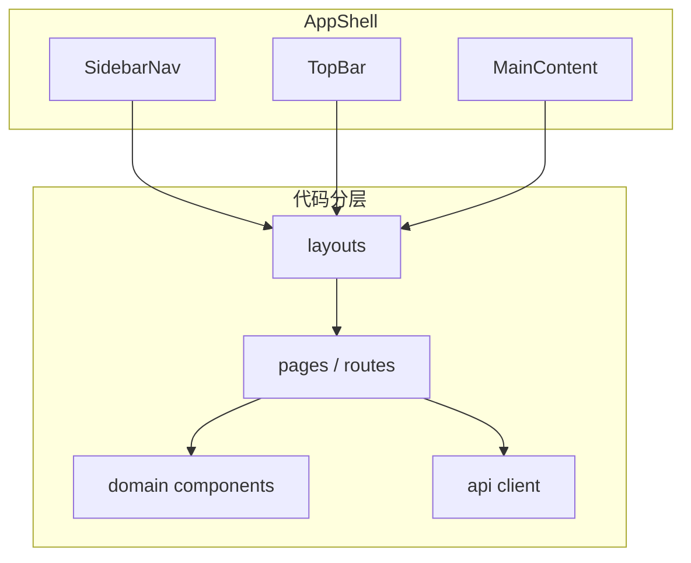

# Web 控制台（Vite + React）

本地控制台：调用 Express API（`src/server/main.ts`）触发 Playwright CLI、查看登录态与 Cursor Hooks 统计。

根目录启动方式见仓库 [**README.md**](../README.md)（`npm run ui:dev`、`npm run ui:server` / `npm run ui:build`）。

生产路径（`npm run ui:start`）下由 Express 对非 `/api` 的 GET 请求回退 **`index.html`**，以支持 React Router 子路径（如 `/hooks`）刷新。

## 技术栈

| 层级 | 选型 |
|------|------|
| 构建 | Vite 6、TypeScript |
| UI | React 19、[Tailwind CSS v4](https://tailwindcss.com/)（`@tailwindcss/vite`） |
| 组件 | [shadcn/ui](https://ui.shadcn.com/)（Radix + `tailwind-merge` / `cva`） |
| 路由 | React Router（侧边栏多页） |

## 目录约定

```
web/
  vite.config.ts      # root = web/；`/api` 代理到 127.0.0.1:3847
  README.md           # 本文
  index.html
  src/
    main.tsx          # 挂载入口
    App.tsx           # BrowserRouter + Routes
    index.css         # Tailwind + CSS 变量主题
    layouts/          # 壳层布局（侧栏 + 顶栏 + Outlet）
    pages/            # 路由页面（Hooks / 登录态 / Features）
    components/       # 业务组件
    components/ui/    # 仅 shadcn 生成组件，勿混业务逻辑
    lib/              # cn() 等工具
    api/              # fetch 封装（/api/*）
```

## 架构借鉴（与开源后台模板的共性）

常见 Admin 模板（如 Dolphin Admin、[Ant Design Pro](https://pro.ant.design/) 的布局思路、[larry-xue/react-admin-dashboard](https://github.com/larry-xue/react-admin-dashboard) 的分层）普遍包含：



- **壳层**：左侧导航 + 顶栏（标题 / 安全提示）+ 主内容滚动区。
- **路由**：按业务切块（本仓库：`/hooks`、`/session`、`/features`），便于扩展。
- **通用交互**：按钮、卡片、表格等走 **shadcn/ui**；业务图表保留结构化 DOM + Tailwind。
- **数据**：同源 `/api/*`，开发态由 Vite 代理到 Express；详见根 README。

## 参考链接

- [shadcn/ui — Vite 安装](https://ui.shadcn.com/docs/installation/vite)
- [Dolphin Admin（React + Vite + 分层示例）](https://github.com/dolphin-admin/react-admin)
- [Tailwind CSS — Vite](https://tailwindcss.com/docs/installation/using-vite)

## 新增 shadcn 组件

可使用官方 CLI（若交互提示模板，选用 **Vite**、**非 monorepo**，工作目录指向 `web/`）。亦可参照 [shadcn/ui — Vite](https://ui.shadcn.com/docs/installation/vite) 手动添加。

```bash
cd web && npx shadcn@latest add button
```

当前仓库已在 [`components/ui/`](src/components/ui/) 手工落地常用 primitive（与 CLI 生成风格一致），便于在无交互环境下构建。
